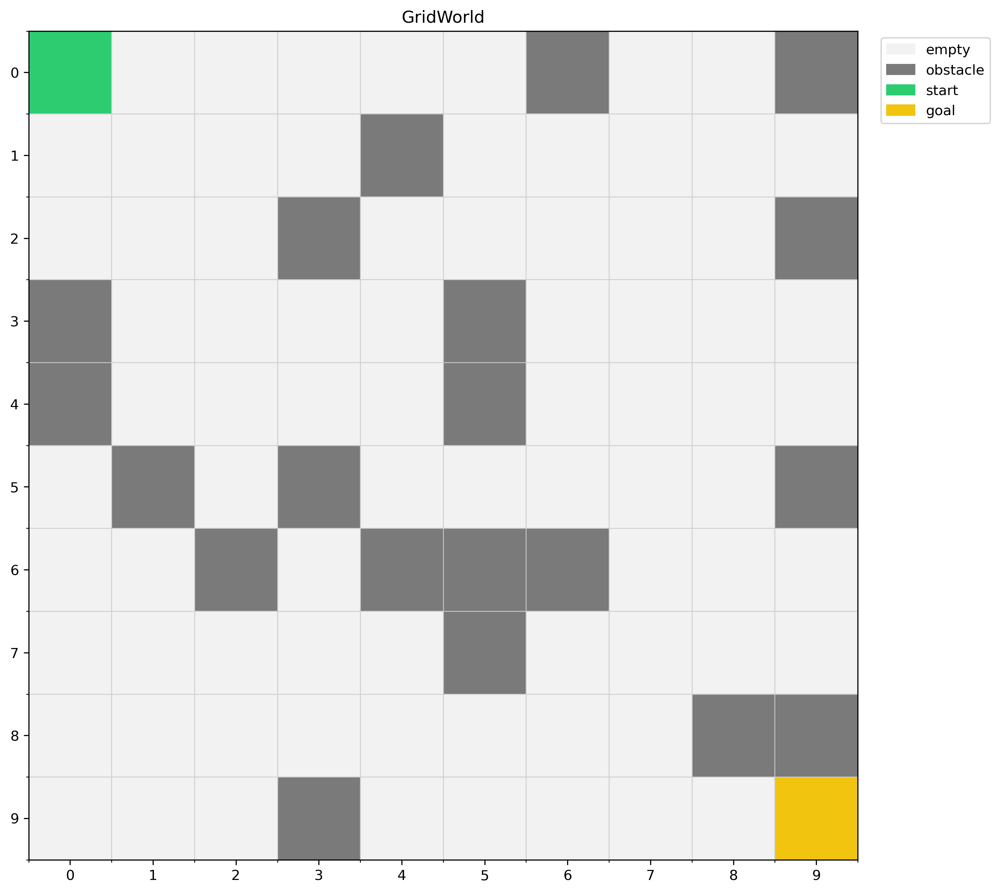
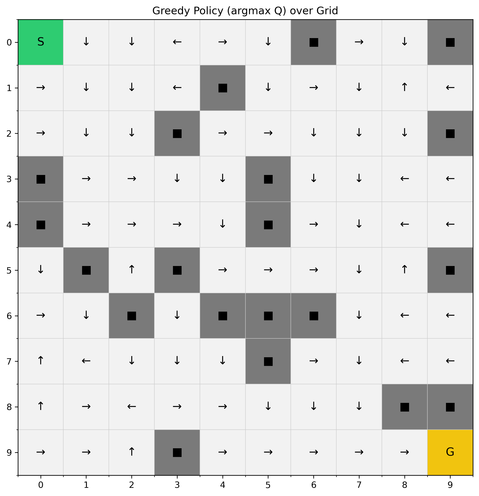
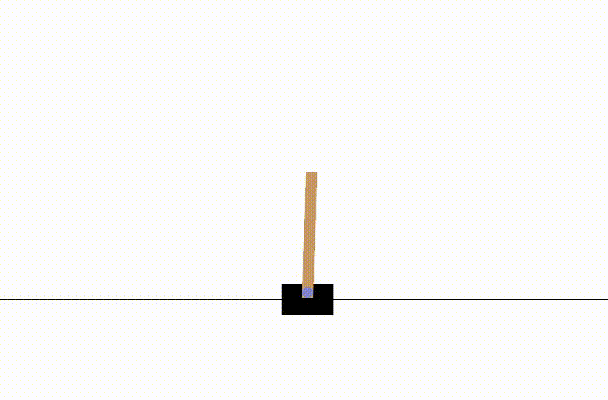
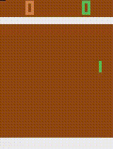

# Reinforcement-Learning
This repo contains some basic RL algorithms that leverage OpenAI Gymnasium and Atari environments where agents are trained.

## Q-Learning Algorithm
Q-Learning is a value-based reinforcement learning algorithm that seeks to learn the optimal action-value function. The core of Q-Learning is the Bellman equation, which updates the Q-values based on the agent's experiences:

$$
Q(s, a) \leftarrow Q(s, a) + \alpha \left[ r + \gamma \max_{a'} Q(s', a') - Q(s, a) \right]
$$

where:
- $Q(s, a)$ is the estimated value of taking action $a$ in state $s$,
- $\alpha$ is the learning rate,
- $r$ is the reward received after taking action $a$,
- $\gamma$ is the discount factor,
- $s'$ is the next state,
- $\max_{a'} Q(s', a')$ is the maximum estimated value for the next state.

This iterative update helps the agent converge towards the optimal policy over time.

Here I have tried to solve our very old gridworld, treating it as an MDP. The gridworld looks like this:

And after the greedy training, the equation converges to the following policy:

## Deep Q-Network Algorithm
Now for a more challenging approach, I have used a series of Dense layers to estimate the q-values for the very famous cartpole problem, 
where we have two actions for the cart:
1. Moving Left (0)
2. Moving Right (1)

With the state observations:
1. **Cart Position**: -4.8 to 4.8
2. **Cart Velocity**: -inf to inf
3. **Pole Angle**: -24° to 24°
4. **Pole Angular Velocity**: -inf to inf

And termination conditions:
1. **Termination**: Pole Angle > ±12°
2. **Termination**: Cart Position > ±2.4
3. **Truncation**: Episode length > 500

Since the observations have infinities, the best we can do is approximate the q-values. Hence we are trying the same old Bellman equation but a bit modified like :

$$
Q(s_t, a_t; \theta) \leftarrow Q(s_t, a_t; \theta) + \alpha [r_t + \gamma \max_{a} Q(s_{t+1}, a; \theta^-) - Q(s_t, a_t; \theta)]
$$  

Where:  
   - $\theta$ represents the parameters of the main network  
   - $\theta^-$ represents the parameters of the target network

Here we have `self.model` and `self.target_model` as the $\theta$ and $\theta^-$ .

The results are quite satisfactory:

as we can observe a stable pole on a moving cart.... Impressive, right? :) 

## Proximal Policy Optimization
Now we have an actor, who acts and a critic(like me), who only criticises about the output. The main loss function we are trying to optimize looks like this:

$L(\theta) = \hat{\mathbb{E}}[L^{CLIP}(\theta) - c_1 L^{VF}(\theta) + c_2 S[\pi_\theta](s)]$

Where:

1. $L^{CLIP}(\theta)$ is the clipped surrogate objective:  
   $L^{CLIP}(\theta) = \min(r_t(\theta)\hat{A}_t, \text{clip}(r_t(\theta), 1-\epsilon, 1+\epsilon)\hat{A}_t)$

2. $L^{VF}(\theta)$ is the value function loss:  
   This is typically a mean squared error between the value function predictions and the actual returns. It can be written as:
   $L^{VF}(\theta) = (V_\theta(s_t) - V^{target}_t)^2$

3. $S[\pi_\theta](s)$ is the entropy of the policy:  
   This encourages exploration by favoring policies that maintain some randomness.

4. $c_1$ and $c_2$ are coefficients that balance the importance of the value function loss and entropy bonus respectively.

The overall algorithm can be outlined as the following:

1. **Initialize** policy parameters $\theta_0$.

2. **Collect Data:**
   - For each environment (total `num_envs`), collect `n_steps` transitions $(s_t, a_t, r_t, s_{t+1})$ using current policy $\pi_{\theta_{\text{old}}}$.
   - Compute rewards, value estimates $V_{\theta_{\text{old}}}(s_t)$, and advantages $\hat{A}_t$ using GAE.

3. **Policy Update Loop** (Repeat for `n_epochs`):
   - Shuffle data and create mini-batches of size `batch_size`.
   - For each mini-batch:
     a) Compute probability ratio: $r_t(\theta) = \frac{\pi_\theta(a_t|s_t)}{\pi_{\theta_{\text{old}}}(a_t|s_t)}$
     
     b) Compute losses:
        - Clipped objective: $L_t^{\text{CLIP}}(\theta) = \min( r_t(\theta) \hat{A}_t, \text{clip}( r_t(\theta), 1 - \epsilon, 1 + \epsilon ) \hat{A}_t )$
        - Value function: $L_t^{\text{VF}}(\theta) = ( V_\theta(s_t) - V_{\text{target}}(s_t) )^2$
        - Entropy bonus: $$ S[\pi_\theta](s_t) = -\sum_a \pi_\theta(a|s_t) \log \pi_\theta(a|s_t) $$
     
     c) Compute total loss:
        $$ L_t(\theta) = -L_t^{\text{CLIP}}(\theta) + c_{\text{vf}} L_t^{\text{VF}}(\theta) - c_{\text{entropy}} S[\pi_\theta](s_t) $$
     
     d) Compute gradients: $$ \nabla_\theta L_t(\theta) $$
     
     e) Apply gradient clipping if $$ \| \nabla_\theta L_t(\theta) \| > \text{max\_grad\_norm} $$
     
     f) Update parameters: $\theta \leftarrow \theta - \alpha \nabla_\theta L_t(\theta)$, where $\alpha$ is the learning rate

**Key Components:**
- **Clipping:** Limits policy updates to stabilize learning.
- **Value Function:** Estimates state values to compute advantages.
- **Entropy Bonus:** Encourages exploration by rewarding policy randomness.
- **Gradient Clipping:** Prevents extreme parameter updates.

Although due to limited computation power, I did not complete the total training, the results upto last point is very promising, the trained **"Ping"** is overkill man:

  

